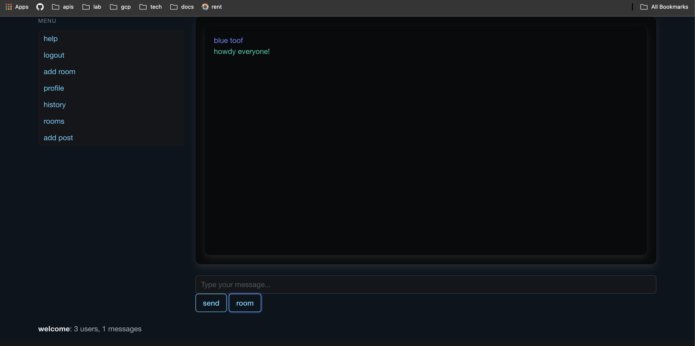

# screamery

### a chat app

go / htmx / bbolt / bulma.

## features
- authentication
- create posts for your profile
- comment on other users posts
- message sanitization
- local db (bbolt)
- messages are only stored in memory (never written to disk)
- send "commands" to the server (see help page)
- a help page

a work in progress but otherwise functional

## install and run
`go build . # in root directory`

```
./scream -h
Usage of ./scream:
  -cert-file string
    	cert file (default "server-cert.pem")
  -db-name string
    	database name (default "chat.db")
  -first-user-mode
    	first user mode
  -key-file string
    	key file (default "server-key.pem")
  -log-file string
    	log file (default "chat.log")
  -message-limit int
    	message limit (default 100)
  -token-bucket string
    	token bucket (default "tokens")
  -url string
    	url (default ":8081")
  -user-bucket string
    	user bucket (default "users")
```

### endpoints
- localhost:8080/add-user to add first user.
- /help for help
- / to hit login
- /room/whatever to create a new room

## example


